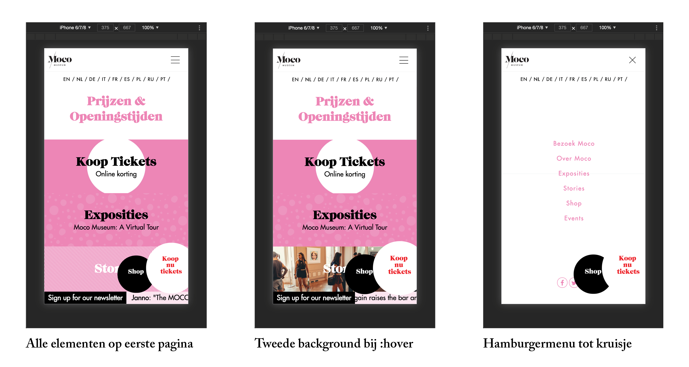

# Procesverslag
**Auteur:** Chevelly Hiralall, 500700481

## Bronnenlijst
1. [Hamburgermenu, line 28 (index.html)](https://www.youtube.com/watch?v=kKRpeFk613I)
2. [Font-awesome stylesheet, line 49 (index.html)](https://cdnjs.cloudflare.com/ajax/libs/font-awesome/4.7.0/css/font-awesome.min.css)
3. [< form > element, line 115 (index.html)](https://developer.mozilla.org/nl/docs/Learn/HTML/Forms/How_to_structure_an_HTML_form)
4. [< strong > element, line 127 (index.html)](https://developer.mozilla.org/en-US/docs/Web/HTML/Element/strong)
5. [< cite > element, line 106, (stories.html)](https://developer.mozilla.org/en-US/docs/Web/HTML/Element/cite)
6. [content pseudo-element, line 70 (style.css)](https://css-tricks.com/css-content/)
7. [translateX, line 467 (style.css)](https://developer.mozilla.org/en-US/docs/Web/CSS/transform-function/translateX)
8. [Animation-timing-function, line 560 (style.css)](https://developer.mozilla.org/en-US/docs/Web/CSS/animation-timing-function)
9. [Element slider, line 634 (style.css)](https://css-tricks.com/css-only-carousel/)
10. [border-image-source, line 765 (style.css)](https://developer.mozilla.org/en-US/docs/Web/CSS/border-image-source)
11. [border-image-slice, line 770 (style.css)](https://developer.mozilla.org/en-US/docs/Web/CSS/border-image-slice)
12. [border-image-repeat: stretch, line 773 (style.css)](https://developer.mozilla.org/en-US/docs/Web/CSS/border-image-repeat)
13. [linear-gradient, line 800 (style.css)](https://developer.mozilla.org/en-US/docs/Web/CSS/CSS_Images/Using_CSS_gradients)
14. [classList.toggle, line 10 (script.js)](https://dlo.mijnhva.nl/d2l/common/dialogs/quickLink/quickLink.d2l?ou=192602&type=coursefile&fileId=FED+20-21+-+Blok+1+-+Oefening+media+queries.pdf)

## Herkansing Eindgesprek (week 10)

*-dit ging goed-*

Naar aanleiding van het eindgesprek en de feedback op mijn opdracht heb ik de volgende punten verbeterd:

**++** De talen navigatie op index.html toont nu bij hoveren een streep onder de li

**++** De links in het hamburgermenu tonen nu bij hoveren een streep onder de li

**++** Bij hoveren over de shop button verandert de achtergrondkleur van zwart naar wit

**++** Bij hoveren over de tickets button verandert de achtergrondkleur van wit naar zwart

**++** De article slider op stories.html heeft met behulp van Javascript rondjes die meebewegen met de transitie van de articles

**++** De artikelen zoals zichtbaar op de webpagina van MOCO is toegevoegd aan stories.html

**++** De footer zoals zichtbaar op de webpagina van MOCO is toegevoegd aan stories.html

**++** De detailpagina (stories.html) is nu 1-op-1 nagemaakt van de webpagina van MOCO

**++** Mijn versie van het Banksy kunstwerk (banksy.html) is nu te vinden onder de link 'Exposities'

**++** Mijn eindopdracht bestaat nu uit 1 stylesheet in plaats van 2

**++** Het lege div'je in de index.html wat een error opleverde is vervangen voor een span element

**++** Mijn 3 HTML files zijn W3C gevalideerd, zie onderstaande screenshots

**++** Mijn CSS file is W3C gevalideerd, zie onderstaande screenshots

**++** Alle files zijn nu nog meer voorzien van comments om de code begrijpelijk te maken voor ander

*-dit was lastig-*

**--** Door het Banksy kunstwerk op een derde pagina te plaatsen en een lijst aan articles aan de tweede pagina toe te voegen ervaarde ik een flink aantal tegenslagen in de CSS file. Ik raakte namelijk volledig het overzicht kwijt wat betreft het gebruiken van pseudo-selecteren. Ik heb zo ongeveer elke mogelijke combinatie (blijkbaar niet dus) geprobeerd om elementen aan te roepen maar het wilde af en toe niet werken op de manier dat ik wilde. Als resultaat hiervan heb ik een classes toegepast om toch tot het gewenste resultaat te komen.

**Screenshot(s):**
Het eindresultaat

W3C validatie - index.html

W3C validatie - stories.html

W3C validatie - banksy.html

W3C validatie - style.css

## Eindgesprek (week 9)

*-dit ging goed-*

**++** Toen ik eenmaal de switch gemaakt had van het namaken van de Tickets pagina naar het namaken van de Stories pagina was ik erg gemotiveerd om een leuke toevoeging te doen aan de pagina waarmee ik de gebruiker kan verrassen. Ik ben dan ook ontzettend trots op de iconische Banksy versnipperaar die ik met CSS na heb kunnen maken.

**++** Waar ik in dit vak erg tegenaan liep was mijn tijdsplanning. Omdat dit mijn herkansingsvak is en ik hiernaast nog het Behavioural Design project volg hield ik vaak weinig tot geen tijd over om aan mijn websiteopdracht te werken en dat vond ik erg jammer. Ik heb niet voor niks ja gezegd tegen het opnieuw doen van dit vak.. dat was omdat ik Frontend Development heel graag onder de knie wilde hebben. In de herfstvakantie heb ik hierom een flink aantal uren vrij gehouden om op mezelf op de opdracht te kunnen storten en dat was echt fantastisch. Als ik eenmaal lekker in the flow zit en mijn mind in HTML & CSS termen dacht ging het als een speer.

**++** In tegenstelling tot eerdere HTML/CSS/JS opdrachten heb ik mijn code dit keer voorzien van heel veel comments. In de huiswerkopdrachten heb ik goed gelet op de manier waarop Sanne het deed, namelijk een erg toelichtende manier. Door dit zelf ook toe te passen maak ik de code voor een ander maar ook voor mezelf op een later moment goed te begrijpen.

*-dit was lastig-*

**--** Tijdens de intake had ik aangegeven dat ik de landingspagina en de tickets pagina wilde namaken maar tijdens het coderen van de Tickets pagina wat bestond uit een gigantisch formulier raakte ik erg gedemotiveerd om het mij niet uitdaagde. Daarnaast had ik al even met een form element mogen spelen op de landingspagina. Hierom heb ik het besluit genomen mijn plan om te gooien en de Stories pagina na te maken in plaats van de Tickets pagina. Op de Stories pagina heb ik gekozen om de slider na te maken en de resterende ruimte te gebruiken voor een bijzondere toevoeging aka surface experience.

**--** Net als bij voortgang 3 vond ik het bij de weg naar het eindresultaat af en toe erg lastig om rekening te houden met te pseudo-selecteren wanneer ik niet in chronologische volgorde werkte. Ik heb mijn code een behoorlijk aantal keer 'kapot' gemaakt omdat ik middenin mijn HTML zat te wroeten. Dit zorgde voor behoorlijk wat vertraging.

**--** Ik heb vorig jaar het vak Frontend for Designers gevolgd bij Sanne. En daar was javascript de boeman en werden we gemotiveerd om enkel in CSS attributen te denken. Ik merkte dat dit bij deze opdracht nog niet helemaal uit mijn systeem was omdat ik eerder dacht in CSS oplossingen dan in het toevoegen van Javascript waardoor ik op het laatste moment mijn code voor het nieuwsbrief formulier aan heb moeten passen om toch een stukje Javascript in mijn opdracht te hebben.

**Screenshot(s):**

### Verslag van meeting

-uitkomsten na afloop-

**^** het eindresultaat is op dit moment nog onvoldoende

**^** er moeten nog een aantal puntjes op de i gezet worden, namelijk:

    ⋅⋅* 1 stylesheet in plaats van 2

    ⋅⋅* styling van de elementen bij hoveren

    ⋅⋅* 1 op 1 met gekozen website mbt detailpagina

    ⋅⋅* w3c validatie, de errors aanpakken

**Screenshot(s):**

## Voortgang 3 (week 6)

### Stand van zaken

*-dit ging goed-*

**++** sinds het tweede voortgangsgesprek waar het erop neer kwam dat ik verreweg was van waar ik moest zijn wat betreft mijn eigen websiteopdracht heb ik een gigantisch inhaalslag kunnen maken

**++** mijn websiteopdracht is voor 75% af, nog steeds 15% verwijderd van waar ik zou moeten zijn maar de voortgang zit erin. Het hamburgermenu is aanwezig en de animatie in de buttons en footer.

*-dit was lastig-*

**--** sinds het eerste voortgangsgesprek heb ik afgesproken zo min mogelijk div'jes en classes te gebruiken en meer te werken met pseudo-selecteren - wat ik hier vooral lastig aan vindt is wanneer je niet in chronologische volgorde werkt, bijvoorbeeld je kiest ervoor om eerst aan de main en footer te werken en dan pas de header, je behoorlijk in de knoop kunt raken met de pseudo-selecteren en de telling ervan. Het vergt wat meer puzzelwerk maar het is niet onmogelijk.

**Screenshot(s):**

### Agenda voor meeting

**^** helaas niet aanwezig kunnen zijn in verband met een beoordelingsgesprek voor het vak Design Ethics

### Verslag van meeting

-uitkomsten na afloop-

**^** niet van toepassing

## Voortgang 2 (week 5)

### Stand van zaken

*-dit ging goed-*

**++** naar aanleiding van het eerste voortgangsgesprek heeft Jelmer erop gehamerd dat ik veel minder div'jes en classes moet gebruiken en veel meer moet werken met pseudo-selectoren. Dit heb ik toegepast waardoor mijn code zichtbaar verbeterd is. Het vergt wat meer nadenkwerk maar het is zeker niet onmogelijk. Zie screenshots.

*-dit was lastig-*

**--** de voortgang wat betreft mijn eigen website is absoluut niet op schema. Reden hiervoor is de extreme drukte bij mijn andere vakken waardoor enkel de huiswerkopdrachten van Frontend passen in mijn planning en niet het werken aan de website opdracht.

**Screenshot(s):**

### Agenda voor meeting

**^** enkel Delano en ik waren aanwezig. Vooraf met Delano afgesproken dat omdat ik weinig tot geen input heb voor het voortgangsgesprek hij de leiding neemt en ik meeluister met zijn feedback

### Verslag van meeting

-uitkomsten na afloop-

**^** weinigt tot geen input kunnen geven in het voortgangsgesprek

**^** afgesproken meer tijd in te plannen om voortgang te maken met mijn eigen website

## Voortgang 1 (week 3)

### Stand van zaken

*-dit ging goed-*

**++** door van te voren een breakdown schets te maken kon ik meteen een goede start maken met het plaatsen van de juiste elementen in mijn HTML document

**++** door de oefeningen te maken heb ik een goede basis kunnen vormen waardoor ik tijdens het coderen gericht kon zoeken naar welke elementen ik nodig heb om het gewenste resultaat te behalen

**++** door de tip van Robert om inspect element te gebruiken heb ik tijdens het coderen een beter begrip kunnen krijgen van hoe de moco website is opgebouwd

*-dit was lastig-*

**--** op het moment dat er veel regels code in mijn html/css staan raak ik het overzicht kwijt

**--** ik heb goed begrip van wat een element kan doen, máár bij het samenvoegen van de verschillende elementen behaal ik helaas toch niet het gewenste resultaat

**--** het is mij niet gelukt om een font toe te voegen wat ik van het web gedownload heb

**--** ik heb te weinig tijd vrij in mijn agenda om fully gefocust te kunnen coderen waardoor ik deze week niet mijn doel (opzet van 2 pagina's) behaald heb

**Screenshot(s):**

### Agenda voor meeting

**^** uitleg vragen over hoe ik een font kan toevoegen vanuit mijn mappen

### Verslag van meeting

-uitkomsten na afloop-

**^** Jelmer heeft mij uitgelegd hoe ik een font vanuit mijn mappen toe kan voegen, namelijk het pad beter beschrijven (../fonts/) - dit is meteen gelukt!

**^** ik heb aangegeven mezelf meer tijd te willen geven om met de code te kunnen spelen en meer vooruitgang te boeken

**^** ik heb afgesproken minder classes te hebben in mijn html en hiervoor in de plaats pseudoselectoren te gebruiken

## Intake (week 1)

**Je startniveau:** *I'm blue da ba dee da ba daa*

**Je focus:** ~~Responsive &~~ Surface

**Je opdracht:** [Moco Museum](https://mocomuseum.nl)

**Screenshots:**

*Pagina 1_desktop*

*Pagina 1_small screen*

*Pagina 2_desktop*

*Pagina 2_small screen*

**Breakdown-schets(en):**

