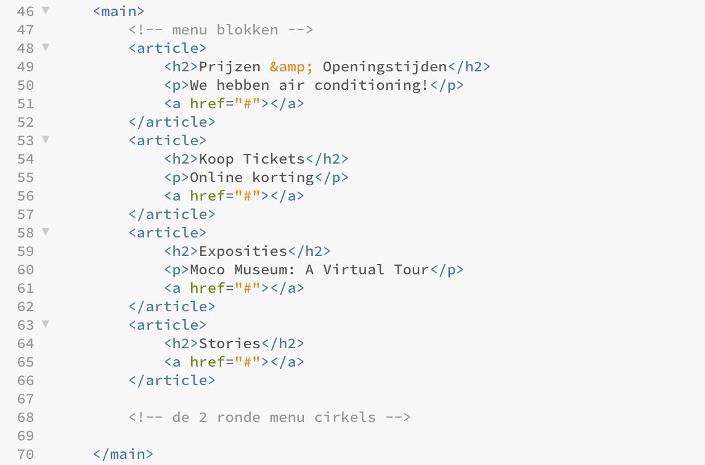

# Procesverslag
**Auteur:** Chevelly Hiralall, 500700481

Markdown cheat cheet: [Hulp bij het schrijven van Markdown](https://github.com/adam-p/markdown-here/wiki/Markdown-Cheatsheet). Nb. de standaardstructuur en de spartaanse opmaak zijn helemaal prima. Het gaat om de inhoud van je procesverslag. Besteedt de tijd voor pracht en praal aan je website.

## Bronnenlijst
1. [Hulp bij het schrijven van Markdown](https://github.com/adam-p/markdown-here/wiki/Markdown-Cheatsheet)
2. [Hulp bij het schrijven van Markdown](https://github.com/adam-p/markdown-here/wiki/Markdown-Cheatsheet)
3. [Hulp bij het schrijven van Markdown](https://github.com/adam-p/markdown-here/wiki/Markdown-Cheatsheet)
4. [Hulp bij het schrijven van Markdown](https://github.com/adam-p/markdown-here/wiki/Markdown-Cheatsheet)
5. [Hulp bij het schrijven van Markdown](https://github.com/adam-p/markdown-here/wiki/Markdown-Cheatsheet)
6. [Hulp bij het schrijven van Markdown](https://github.com/adam-p/markdown-here/wiki/Markdown-Cheatsheet)

## Eindgesprek (week 7/8)

*-dit ging goed-*

**++**

*-dit was lastig-*

**--**

**Screenshot(s):**

## Voortgang 3 (week 6)

### Stand van zaken

*-dit ging goed-*

**++** sinds het tweede voortgangsgesprek waar het erop neer kwam dat ik verreweg was van waar ik moest zijn wat betreft mijn eigen websiteopdracht heb ik een gigantisch inhaalslag kunnen maken

**++** mijn websiteopdracht is voor 75% af, nog steeds 15% verwijderd van waar ik zou moeten zijn maar de voortgang zit erin. Het hamburgermenu is aanwezig en de animatie in de buttons en footer.

*-dit was lastig-*

**--** sinds het eerste voortgangsgesprek heb ik afgesproken zo min mogelijk div'jes en classes te gebruiken en meer te werken met pseudo-selecteren - wat ik hier vooral lastig aan vindt is wanneer je niet in chronologische volgorde werkt, bijvoorbeeld je kiest ervoor om eerst aan de main en footer te werken en dan pas de header, je behoorlijk in de knoop kunt raken met de pseudo-selecteren en de telling ervan. Het vergt wat meer puzzelwerk maar het is niet onmogelijk.

**Screenshot(s):**

### Agenda voor meeting

**^** helaas niet aanwezig kunnen zijn in verband met een beoordelingsgesprek voor het vak Design Ethics

### Verslag van meeting

-uitkomsten na afloop-

**^** niet van toepassing

## Voortgang 2 (week 5)

### Stand van zaken

*-dit ging goed-*

**++** naar aanleiding van het eerste voortgangsgesprek heeft Jelmer erop gehamerd dat ik veel minder div'jes en classes moet gebruiken en veel meer moet werken met pseudo-selectoren. Dit heb ik toegepast waardoor mijn code zichtbaar verbeterd is. Het vergt wat meer nadenkwerk maar het is zeker niet onmogelijk. Zie screenshots.

*-dit was lastig-*

**--** de voortgang wat betreft mijn eigen website is absoluut niet op schema. Reden hiervoor is de extreme drukte bij mijn andere vakken waardoor enkel de huiswerkopdrachten van Frontend passen in mijn planning en niet het werken aan de website opdracht.

**Screenshot(s):**

### Agenda voor meeting

**^** enkel Delano en ik waren aanwezig. Vooraf met Delano afgesproken dat omdat ik weinig tot geen input heb voor het voortgangsgesprek hij de leiding neemt en ik meeluister met zijn feedback

### Verslag van meeting

-uitkomsten na afloop-

**^** weinigt tot geen input kunnen geven in het voortgangsgesprek

**^** afgesproken meer tijd in te plannen om voortgang te maken met mijn eigen website

## Voortgang 1 (week 3)

### Stand van zaken

*-dit ging goed-*

**++** door van te voren een breakdown schets te maken kon ik meteen een goede start maken met het plaatsen van de juiste elementen in mijn HTML document

**++** door de oefeningen te maken heb ik een goede basis kunnen vormen waardoor ik tijdens het coderen gericht kon zoeken naar welke elementen ik nodig heb om het gewenste resultaat te behalen

**++** door de tip van Robert om inspect element te gebruiken heb ik tijdens het coderen een beter begrip kunnen krijgen van hoe de moco website is opgebouwd

*-dit was lastig-*

**--** op het moment dat er veel regels code in mijn html/css staan raak ik het overzicht kwijt

**--** ik heb goed begrip van wat een element kan doen, máár bij het samenvoegen van de verschillende elementen behaal ik helaas toch niet het gewenste resultaat

**--** het is mij niet gelukt om een font toe te voegen wat ik van het web gedownload heb

**--** ik heb te weinig tijd vrij in mijn agenda om fully gefocust te kunnen coderen waardoor ik deze week niet mijn doel (opzet van 2 pagina's) behaald heb

**Screenshot(s):**

### Agenda voor meeting

**^** uitleg vragen over hoe ik een font kan toevoegen vanuit mijn mappen

### Verslag van meeting

-uitkomsten na afloop-

**^** Jelmer heeft mij uitgelegd hoe ik een font vanuit mijn mappen toe kan voegen, namelijk het pad beter beschrijven (../fonts/) - dit is meteen gelukt!

**^** ik heb aangegeven mezelf meer tijd te willen geven om met de code te kunnen spelen en meer vooruitgang te boeken

**^** ik heb afgesproken minder classes te hebben in mijn html en hiervoor in de plaats pseudoselectoren te gebruiken

## Intake (week 1)

**Je startniveau:** *I'm blue da ba dee da ba daa*

**Je focus:** ~~Responsive &~~ Surface

**Je opdracht:** [Moco Museum](https://mocomuseum.nl)

**Screenshots:**

*Pagina 1_desktop*

*Pagina 1_small screen*

*Pagina 2_desktop*

*Pagina 2_small screen*

**Breakdown-schets(en):**

